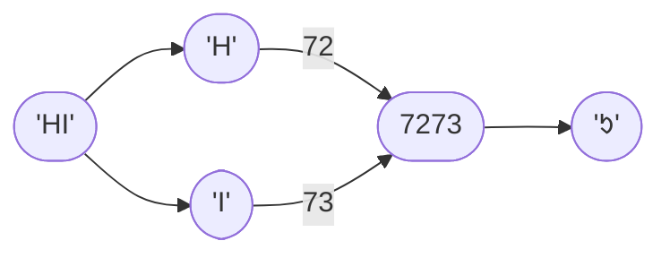

# Compression Mode `01` — Two-Digit CharCode Concatenation <Badge type="tip" text="since v1.0.0" />
This compression mode operates on the **decimal representation** of character codes.

It concatenates pairs of two-digit codes into a four-digit decimal number.

## How It Works

### Step-by-Step Walkthrough
Input: `HELLO!`
> `{{ 'H'.charCodeAt(0) }}`
> `{{ 'E'.charCodeAt(0) }}`
> `{{ 'L'.charCodeAt(0) }}`
> `{{ 'L'.charCodeAt(0) }}`
> `{{ 'O'.charCodeAt(0) }}`
> `{{ '!'.charCodeAt(0) }}`

1. Chunkify: `HE`, `LL`, `O!`
2. Convert to character codes: `{{ 'H'.charCodeAt(0) }}` and `{{ 'E'.charCodeAt(0) }}`, `{{ 'L'.charCodeAt(0) }}` and `{{ 'L'.charCodeAt(0) }}`, `{{ 'O'.charCodeAt(0) }}` and `{{ '!'.charCodeAt(0) }}`
3. Concatenate character code pairs as strings: `{{ 'H'.charCodeAt(0).toString() + 'E'.charCodeAt(0).toString() }}`, `{{ 'L'.charCodeAt(0).toString().repeat(2) }}`, `{{ 'O'.charCodeAt(0).toString() + '!'.charCodeAt(0).toString() }}`
4. Convert to UTF-16 characters: `{{ String.fromCharCode(parseInt('H'.charCodeAt(0).toString() + 'E'.charCodeAt(0).toString())) }}`, `{{ String.fromCharCode(parseInt('L'.charCodeAt(0).toString().repeat(2))) }}`, `{{ String.fromCharCode(parseInt('O'.charCodeAt(0).toString() + '!'.charCodeAt(0).toString())) }}`

Output: `{{ String.fromCharCode(parseInt('H'.charCodeAt(0).toString() + 'E'.charCodeAt(0).toString())) + String.fromCharCode(parseInt('L'.charCodeAt(0).toString().repeat(2))) + String.fromCharCode(parseInt('O'.charCodeAt(0).toString() + '!'.charCodeAt(0).toString())) }}`
> `{{ 'H'.charCodeAt(0).toString() + 'E'.charCodeAt(0).toString() }}`
> `{{ 'L'.charCodeAt(0).toString().repeat(2) }}`
> `{{ 'O'.charCodeAt(0).toString() + '!'.charCodeAt(0).toString() }}`
