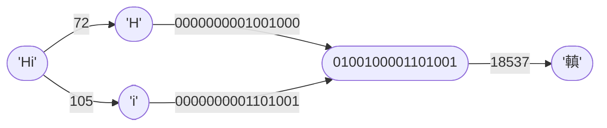

# Compression Mode `02` — Two-Byte CharCode Concatenation <Badge type="tip" text="since v1.0.0" />
This compression mode operates on the **binary representation** of character codes.

It concatenates pairs of two-byte (8 bits) codes into a four-byte (16 bits) binary character code.

## How It Works

## Step-by-Step Walkthrough
Input: `Hello!`
> `{{ 'H'.charCodeAt(0).toString(2).padStart(16,'0') }}`
> `{{ 'e'.charCodeAt(0).toString(2).padStart(16,'0') }}`  
> `{{ 'l'.charCodeAt(0).toString(2).padStart(16,'0') }}`
> `{{ 'l'.charCodeAt(0).toString(2).padStart(16,'0') }}`  
> `{{ 'o'.charCodeAt(0).toString(2).padStart(16,'0') }}`
> `{{ '!'.charCodeAt(0).toString(2).padStart(16,'0') }}`

1. Chunkify: `He`, `ll`, `o!`
2. Convert to binary character codes: `{{ 'H'.charCodeAt(0).toString(2) }}` and `{{ 'e'.charCodeAt(0).toString(2) }}`, `{{ 'l'.charCodeAt(0).toString(2) }}` and `{{ 'l'.charCodeAt(0).toString(2) }}`, `{{ 'o'.charCodeAt(0).toString(2) }}` and `{{ '!'.charCodeAt(0).toString(2) }}`
3. Concatenate binary character code pairs as strings: `{{ 'H'.charCodeAt(0).toString(2).padStart(8,'0') + 'e'.charCodeAt(0).toString(2).padStart(8,'0') }}`, `{{ 'l'.charCodeAt(0).toString(2).padStart(8,'0').repeat(2) }}`, `{{ 'o'.charCodeAt(0).toString(2).padStart(8,'0') + '!'.charCodeAt(0).toString(2).padStart(8,'0') }}`
4. Convert to UTF-16 characters: `{{ String.fromCharCode(parseInt('H'.charCodeAt(0).toString(2).padStart(8,'0') + 'e'.charCodeAt(0).toString(2).padStart(8,'0'), 2)) }}`, `{{ String.fromCharCode(parseInt('l'.charCodeAt(0).toString(2).padStart(8,'0').repeat(2), 2)) }}`, `{{ String.fromCharCode(parseInt('o'.charCodeAt(0).toString(2).padStart(8,'0') + '!'.charCodeAt(0).toString(2).padStart(8,'0'), 2)) }}`

Output: `{{ String.fromCharCode(parseInt('H'.charCodeAt(0).toString(2).padStart(8,'0') + 'e'.charCodeAt(0).toString(2).padStart(8,'0'), 2)) + String.fromCharCode(parseInt('l'.charCodeAt(0).toString(2).padStart(8,'0').repeat(2), 2)) + String.fromCharCode(parseInt('o'.charCodeAt(0).toString(2).padStart(8,'0') + '!'.charCodeAt(0).toString(2).padStart(8,'0'), 2)) }}`
> `{{ ('H'.charCodeAt(0).toString(2).padStart(8,'0') + 'e'.charCodeAt(0).toString(2).padStart(8,'0')).padStart(16,'0') }}`
> `{{ 'l'.charCodeAt(0).toString(2).padStart(8,'0').repeat(2).padStart(16,'0') }}`
> `{{ ('o'.charCodeAt(0).toString(2).padStart(8,'0') + '!'.charCodeAt(0).toString(2).padStart(8,'0')).padStart(16,'0') }}`
