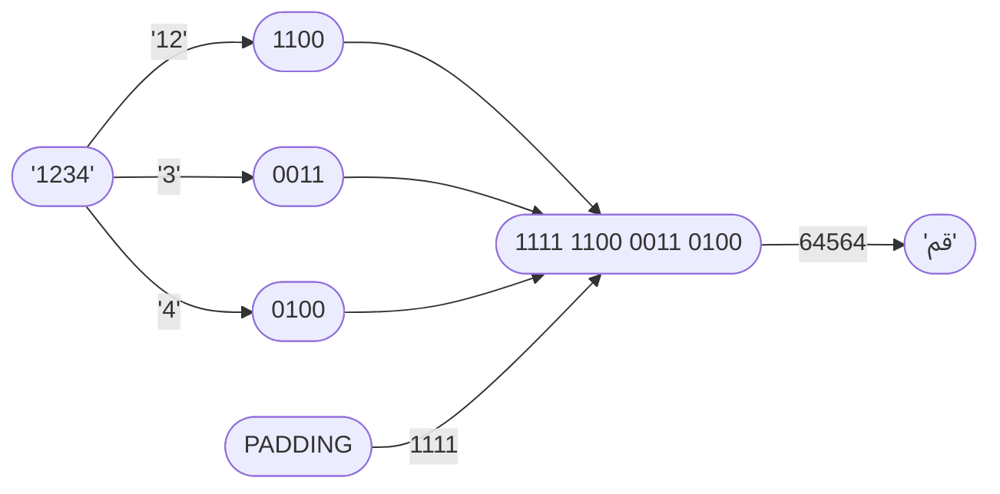

# Compression Mode `03` — Decimal Integer Packing <Badge type="tip" text="since v1.0.0" />
This compression mode operates on **decimal integers**.

It converts each digit in an integer to a nibble (4 bits) and it also converts decimal representation of hexadecimal digits (except for `15`/`F`) to nibbles. This means that `10` (`A`), `11` (`B`), `12` (`C`), `13` (`D`), and `14` (`E`) are single digits, not two. `15` is converted as two digits since `F` is used for padding for correct UTF-16 output, so actually internally it operates on `base-15`.
::: warning To avoid confusion
This mode operates on **decimal input only**, not hexadecimal, not `base-15` — Input should only contain these characters: `0`, `1`, `2`, `3`, `4`, `5`, `6`, `7`, `8`, and `9`.
:::

## How It Works

## Encoding Table

| Decimal | Encoded digit | Binary |
|--------:|:--------------|:------:|
| 0       | 0             | 0000   |
| 1       | 1             | 0001   |
| 2       | 2             | 0010   |
| 3       | 3             | 0011   |
| 4       | 4             | 0100   |
| 5       | 5             | 0101   |
| 6       | 6             | 0110   |
| 7       | 7             | 0111   |
| 8       | 8             | 1000   |
| 9       | 9             | 1001   |
| 10      | A             | 1010   |
| 11      | B             | 1011   |
| 12      | C             | 1100   |
| 13      | D             | 1101   |
| 14      | E             | 1110   |
|(padding)| F             | 1111   |
