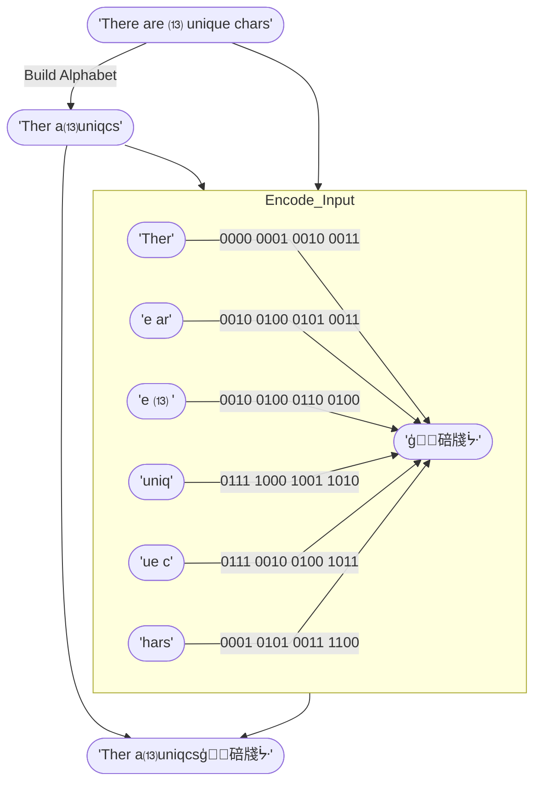

# Compression Mode `04` — Alphabet Encoding <Badge type="tip" text="since v1.1.0" />
This compression mode builds an alphabet from the input string and encodes the string using compact indices into that alphabet.

It operates only on strings with fewer than 16 unique characters, so each index fits into a nibble (4 bits). Like [Compression Mode `03`](03), it uses `1111` as padding for correct UTF-16 output, which is why the practical limit is 15 unique characters rather than 16.

## How It Works

