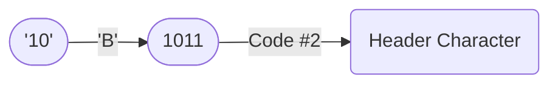

# Compression Mode `06` — Inline Integer Encoding <Badge type="tip" text="since v2.0.0" />
This compression mode is designed for **very small non-negative integers** and ensures that JSSC **does not inflate the output** in this specific case. 

It is intended for use in databases, for example to store values like a "followers count".
When the integer is greater than `14`, JSSC falls back to [compression mode `03`](03).

## How It Works
The integer value is stored directly in the **`Code #2` block** of the [Header Character](../header.md).

## Encoding Table
| Decimal | Encoded digit | Binary |
|--------:|:--------------|:------:|
| 0       | 1             | 0001   |
| 1       | 2             | 0010   |
| 2       | 3             | 0011   |
| 3       | 4             | 0100   |
| 4       | 5             | 0101   |
| 5       | 6             | 0110   |
| 6       | 7             | 0111   |
| 7       | 8             | 1000   |
| 8       | 9             | 1001   |
| 9       | A             | 1010   |
| 10      | B             | 1011   |
| 11      | C             | 1100   |
| 12      | D             | 1101   |
| 13      | E             | 1110   |
| 14      | F             | 1111   |

## [Header Character](../header.md) Usage
| Name | Usage |
|--:|:--|
| Code #1 | `00` or `06` |
| Code #2 | Encoded Integer |
| Code #3 | `default` |
| i? | `false` |
| o? | `false` |
| s? | `false` |
| b? | `default` |
