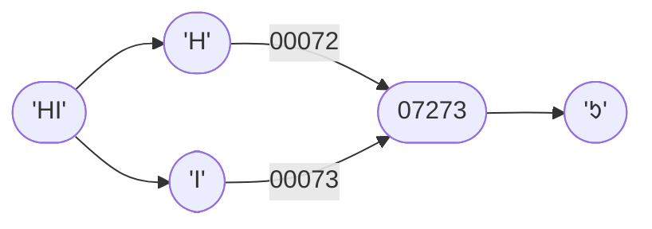

# Режим Сжатия `01` — Two-Digit CharCode Concatenation <Badge type="tip" text="с v1.0.0" />
Этот режим сжатия работает на **десятичных** кодах символов.

Он соединяет пары двузначных кодов в четырехзначное десятичное число.

## Как это работает

## Пошаговый разбор
Входные данные: `HELLO!`
> `{{ String('H'.charCodeAt(0)).padStart(5,'0') }}`
> `{{ String('E'.charCodeAt(0)).padStart(5,'0') }}`
> `{{ String('L'.charCodeAt(0)).padStart(5,'0') }}`
> `{{ String('L'.charCodeAt(0)).padStart(5,'0') }}`
> `{{ String('O'.charCodeAt(0)).padStart(5,'0') }}`
> `{{ String('!'.charCodeAt(0)).padStart(5,'0') }}`

1. Деление на пары: `HE`, `LL`, `O!`
2. Конвертация в коды символов: `{{ 'H'.charCodeAt(0) }}` и `{{ 'E'.charCodeAt(0) }}`, `{{ 'L'.charCodeAt(0) }}` и `{{ 'L'.charCodeAt(0) }}`, `{{ 'O'.charCodeAt(0) }}` и `{{ '!'.charCodeAt(0) }}`
3. Соединение пар кодов символов как string: `{{ 'H'.charCodeAt(0).toString() + 'E'.charCodeAt(0).toString() }}`, `{{ 'L'.charCodeAt(0).toString().repeat(2) }}`, `{{ 'O'.charCodeAt(0).toString() + '!'.charCodeAt(0).toString() }}`
4. Конвертация в UTF-16: `{{ String.fromCharCode(parseInt('H'.charCodeAt(0).toString() + 'E'.charCodeAt(0).toString())) }}`, `{{ String.fromCharCode(parseInt('L'.charCodeAt(0).toString().repeat(2))) }}`, `{{ String.fromCharCode(parseInt('O'.charCodeAt(0).toString() + '!'.charCodeAt(0).toString())) }}`

Выходные данные: `{{ String.fromCharCode(parseInt('H'.charCodeAt(0).toString() + 'E'.charCodeAt(0).toString())) + String.fromCharCode(parseInt('L'.charCodeAt(0).toString().repeat(2))) + String.fromCharCode(parseInt('O'.charCodeAt(0).toString() + '!'.charCodeAt(0).toString())) }}`
> `{{ ('H'.charCodeAt(0).toString() + 'E'.charCodeAt(0).toString()).padStart(5,'0') }}`
> `{{ 'L'.charCodeAt(0).toString().repeat(2).padStart(5,'0') }}`
> `{{ ('O'.charCodeAt(0).toString() + '!'.charCodeAt(0).toString()).padStart(5,'0') }}`
