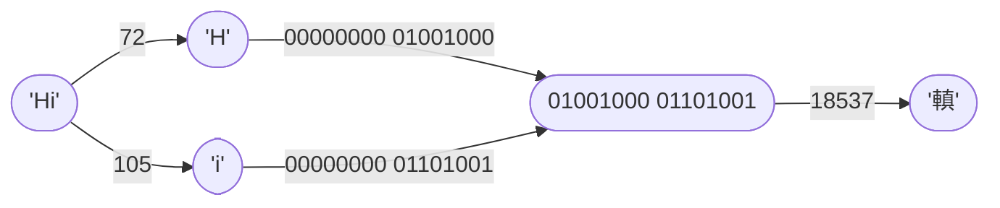

# Режим Сжатия `02` — Two-Byte CharCode Concatenation <Badge type="tip" text="с v1.0.0" />
Этот режим сжатия работает на **двоичных** кодах символов.

Он соединяет пары двухбайтовых (8 бит) кодов в четырехбайтовые (16 бит) коды символов.

## Как это работает

## Пошаговый разбор
Входные данные: `Hello!`
> `{{ 'H'.charCodeAt(0).toString(2).padStart(16,'0') }}`
> `{{ 'e'.charCodeAt(0).toString(2).padStart(16,'0') }}`  
> `{{ 'l'.charCodeAt(0).toString(2).padStart(16,'0') }}`
> `{{ 'l'.charCodeAt(0).toString(2).padStart(16,'0') }}`  
> `{{ 'o'.charCodeAt(0).toString(2).padStart(16,'0') }}`
> `{{ '!'.charCodeAt(0).toString(2).padStart(16,'0') }}`

1. Деление на пары: `He`, `ll`, `o!`
2. Конвертация в коды символов в двоичной системе счисления: `{{ 'H'.charCodeAt(0).toString(2) }}` и `{{ 'e'.charCodeAt(0).toString(2) }}`, `{{ 'l'.charCodeAt(0).toString(2) }}` и `{{ 'l'.charCodeAt(0).toString(2) }}`, `{{ 'o'.charCodeAt(0).toString(2) }}` и `{{ '!'.charCodeAt(0).toString(2) }}`
3. Соединение пар кодов символов как string: `{{ 'H'.charCodeAt(0).toString(2).padStart(8,'0') + 'e'.charCodeAt(0).toString(2).padStart(8,'0') }}`, `{{ 'l'.charCodeAt(0).toString(2).padStart(8,'0').repeat(2) }}`, `{{ 'o'.charCodeAt(0).toString(2).padStart(8,'0') + '!'.charCodeAt(0).toString(2).padStart(8,'0') }}`
4. Конвертация в UTF-16: `{{ String.fromCharCode(parseInt('H'.charCodeAt(0).toString(2).padStart(8,'0') + 'e'.charCodeAt(0).toString(2).padStart(8,'0'), 2)) }}`, `{{ String.fromCharCode(parseInt('l'.charCodeAt(0).toString(2).padStart(8,'0').repeat(2), 2)) }}`, `{{ String.fromCharCode(parseInt('o'.charCodeAt(0).toString(2).padStart(8,'0') + '!'.charCodeAt(0).toString(2).padStart(8,'0'), 2)) }}`

Выходные данные: `{{ String.fromCharCode(parseInt('H'.charCodeAt(0).toString(2).padStart(8,'0') + 'e'.charCodeAt(0).toString(2).padStart(8,'0'), 2)) + String.fromCharCode(parseInt('l'.charCodeAt(0).toString(2).padStart(8,'0').repeat(2), 2)) + String.fromCharCode(parseInt('o'.charCodeAt(0).toString(2).padStart(8,'0') + '!'.charCodeAt(0).toString(2).padStart(8,'0'), 2)) }}`
> `{{ ('H'.charCodeAt(0).toString(2).padStart(8,'0') + 'e'.charCodeAt(0).toString(2).padStart(8,'0')).padStart(16,'0') }}`
> `{{ 'l'.charCodeAt(0).toString(2).padStart(8,'0').repeat(2).padStart(16,'0') }}`
> `{{ ('o'.charCodeAt(0).toString(2).padStart(8,'0') + '!'.charCodeAt(0).toString(2).padStart(8,'0')).padStart(16,'0') }}`
