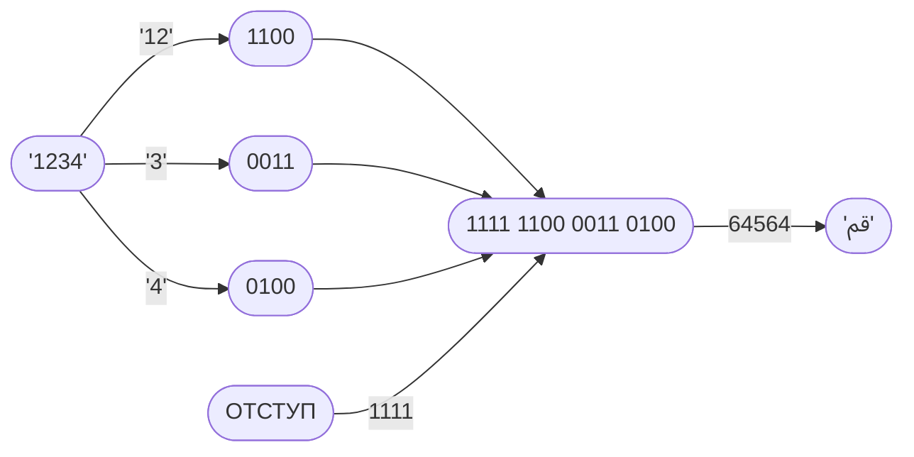

# Режим Сжатия `03` — Decimal Integer Packing <Badge type="tip" text="с v1.0.0" />
Этот режим сжатия работает с **неотрицательными целыми числами в десятичной системе счисления**.

Он конвертирует каждую цифру в полубайт (4 бита) и также конвертирует шестнадцатеричные цифры в десятичном виде (кроме `15`/`F`) в полубайты. Это значит, что `10` (`A`), `11` (`B`), `12` (`C`), `13` (`D`) и `14` (`E`) — цифры или же одинарные символы, не двойные. `15` рассматривается как две цифры, так как `F` используется для отступов для того, чтобы выходные данные были корректными в виде UTF-16, то есть на самом деле данный режим сжатия внутренне работает с пятнадцатеричной системой счисления.
::: warning Важное уточнение
Данный режим сжатия работает с **числами в десятичной системе счисления**, не шестнадцатеричной и не пятнадцатеричной. Входные данные должны содержать только следующие символы: `0`, `1`, `2`, `3`, `4`, `5`, `6`, `7`, `8` и `9`.
:::

## Как это работает

## Таблица кодировки

| Число   | Закодированное число | Двоичный код |
|--------:|:--------------|:------:|
| 0       | 0             | 0000   |
| 1       | 1             | 0001   |
| 2       | 2             | 0010   |
| 3       | 3             | 0011   |
| 4       | 4             | 0100   |
| 5       | 5             | 0101   |
| 6       | 6             | 0110   |
| 7       | 7             | 0111   |
| 8       | 8             | 1000   |
| 9       | 9             | 1001   |
| 10      | A             | 1010   |
| 11      | B             | 1011   |
| 12      | C             | 1100   |
| 13      | D             | 1101   |
| 14      | E             | 1110   |
|(отступ) | F             | 1111   |
