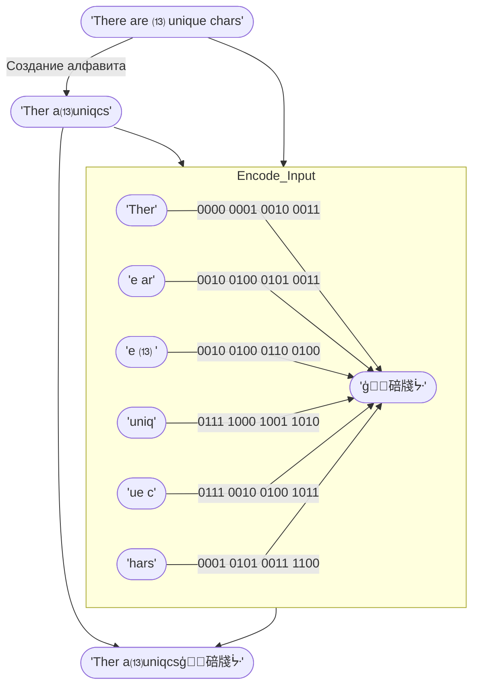

# Режим Сжатия `04` — Alphabet Encoding <Badge type="tip" text="с v1.1.0" />
Этот режим сжатия создаёт алфавит из входных данных и кодирует входные данные, используя идентификаторы из созданного алфавита.

Он работает только на тексте, содержащем менее 16 уникальных символов, чтобы каждый идентификатор поместился в полубайт (4 бита). Как и [Режим Сжатия `03`](03), данный режим сжатия использует `1111` как отступ для того, чтобы выходные данные были корректными в виде UTF-16, и это и есть причина на лимит в 15 уникальных символов, а не 16.

## Как это работает

