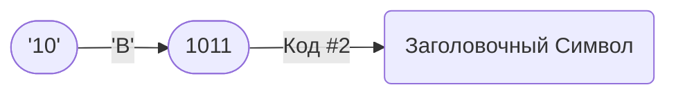

# Режим Сжатия `06` — Inline Integer Encoding <Badge type="tip" text="с v2.0.0" />
Этот режим сжатия сделан для **очень маленьких неотрицательных целых чисел в десятичной системе счисления**, чтобы JSSC **не раздувал выходные данные** в таких случаях.

Данный режим сжатия создан для того, чтобы JSSC можно было использовать в базах данных, например для хранения значений как «счетчик подписчиков».
Когда число больше `14`, JSSC использует [Режим Сжатия `03`](03).

## Как это работает
Число хранится прямо в **блоке «`Код #2`»** в [Заголовочном Символе](../header.md).

## Таблица кодировки
|   Число | Закодированное число | Двоичный код |
|--------:|:--------------|:------:|
| 0       | 1             | 0001   |
| 1       | 2             | 0010   |
| 2       | 3             | 0011   |
| 3       | 4             | 0100   |
| 4       | 5             | 0101   |
| 5       | 6             | 0110   |
| 6       | 7             | 0111   |
| 7       | 8             | 1000   |
| 8       | 9             | 1001   |
| 9       | A             | 1010   |
| 10      | B             | 1011   |
| 11      | C             | 1100   |
| 12      | D             | 1101   |
| 13      | E             | 1110   |
| 14      | F             | 1111   |

## Использование [Заголовочного Символа](../header.md)
| Название | Использование |
|--:|:--|
| Код #1 | `00` или `06` |
| Код #2 | Закодированное число |
| Код #3 | `по умолчанию` |
| i? | `false` |
| o? | `false` |
| s? | `false` |
| b? | `по умолчанию` |
